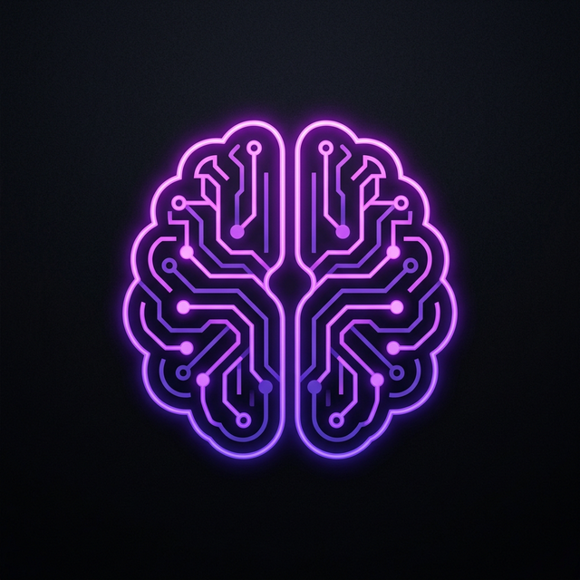

<div align="center">
  
  <h1>Vidyaraa AI Portal</h1>
  <p><strong>Building the Artificial Intelligence Ecosystem of Jammu & Kashmir</strong></p>
</div>

<br />

## 🌟 Overview

Vidyaraa is a pioneering initiative focused on establishing Jammu & Kashmir as a premier hub for Artificial Intelligence. The Vidyaraa AI Portal serves as the central nexus for student talent, academic research, and industry collaboration, empowering the next generation of AI leaders.

This front-end application features a world-class, immersive UI/UX built with React, styled with Tailwind CSS, and powered by high-performance animations using Framer Motion and Lenis scroll.

## ✨ Key Features

*   **Immersive Design:** A premium dark-theme aesthetic ("Live OS" feel) featuring glassmorphism, glowing neon accents, and subtle particle/mesh backgrounds (inspired by top Awwwards design sites).
*   **Fluid Animations:** 
    *   Smooth, physics-based scroll mechanics (Lenis).
    *   Character-level 3D text reveals.
    *   Parallax depth layering in the hero section.
    *   Interactive magnetic hover cards and layout transitions.
*   **Performance Optimized:** Fully responsive across all devices, optimized for standard Lighthouse metrics, and pre-configured for static deployment.
*   **Production Ready:** Complete with SEO meta tags (OpenGraph, Instagram Cards), `robots.txt`, XML Sitemaps, and a Web App Manifest.

## 🛠️ Technology Stack

*   **Framework:** [React 18](https://react.dev/) + [Vite](https://vitejs.dev/)
*   **Styling:** [Tailwind CSS](https://tailwindcss.com/)
*   **Animations:** [Framer Motion](https://www.framer.com/motion/)
*   **Smooth Scroll:** [Lenis](https://lenis.studiofreight.com/)
*   **Icons:** [Lucide React](https://lucide.dev/)
*   **Routing:** [React Router DOM](https://reactrouter.com/)

## 🚀 Getting Started

To run this project locally, follow these steps:

### Prerequisites
Make sure you have [Node.js](https://nodejs.org/) installed (v18 or higher is recommended).

### Installation

1.  **Clone the repository:**
    ```bash
    git clone https://github.com/Amitaddi2010/vidyaraa.git
    cd vidyaraa
    ```

2.  **Install dependencies:**
    ```bash
    npm install
    # or
    yarn install
    ```

3.  **Start the development server:**
    ```bash
    npm run dev
    # or
    yarn dev
    ```

4.  **Open your browser:**
    Navigate to `http://localhost:5173` to view the application.

## 📦 Building for Production

To generate an optimized production build:

```bash
npm run build
```
The optimized static files will be placed in the `dist` directory, ready to be deployed to platforms like Vercel, Netlify, or GitHub Pages.

## 📂 Project Structure

```text
vidyaraa/
├── public/                 # Static assets (Favicon, robots.txt, sitemap, manifest)
├── src/
│   ├── components/         # Reusable React components (Hero, About, Events, etc.)
│   ├── App.jsx             # Main application layout and routing setup
│   ├── index.css           # Global stylesheets and Tailwind directives
│   └── main.jsx            # React root injection point
├── index.html              # Main HTML template with SEO configurations
├── tailwind.config.js      # Tailwind CSS configuration
└── vite.config.js          # Vite configuration
```

## 🤝 Contributing

We welcome contributions to the Vidyaraa initiative! 
1. Fork the project.
2. Create your feature branch (`git checkout -b feature/AmazingFeature`).
3. Commit your changes (`git commit -m 'Add some AmazingFeature'`).
4. Push to the branch (`git push origin feature/AmazingFeature`).
5. Open a Pull Request.

## 📄 License

Distributed under the MIT License. See `LICENSE` for more information.

---
<div align="center">
  <p>Engineered for the future of AI in J&K • <a href="https://vidyaraa.ai">Vidyaraa.ai</a></p>
</div>
